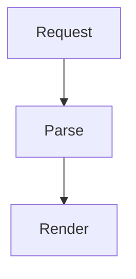

# Code Reader

Code Reader is a Neovim plugin for reading AI-authored code and diff walkthroughs next to the files they explain. It opens a three-pane reading layout with the explanation on the left, source or before/after diff content on the right, and a navigable outline below the explanation.

Use it when an AI assistant has produced a structured walkthrough and you want to review the implementation in Neovim without jumping between Markdown, source files, and patches by hand.


## Features

- Source walkthroughs driven by `type: code-reader` Markdown files.
- Diff walkthroughs driven by `type: code-reader-diff` Markdown files and unified diff patches.
- Synchronized code, explanation, and TOC views.
- Step navigation with `:CodeReaderNext`, `:CodeReaderPrev`, TOC entries, and internal `[[step-id]]` links.
- Focus highlighting for the current source range or diff hunk, with optional dimming for unrelated lines.
- Side-by-side diff reading with old/new gutters, changed-line markers, moved-line detection, and inline modified-span highlights.
- Tree-sitter symbol links, with LSP document-highlight support when available.
- Mermaid code block rendering through an optional Node helper.
- Standalone PDF export with Mermaid SVG, syntax highlighting, and separated explanation/code pages.
- Optional integration with `render-markdown.nvim` for richer Markdown rendering.
- Optional integration with `neoscroll.nvim` for same-buffer range movement.
- Visual-range reference copying with `:CodeReaderCopyRef`, useful when asking an AI assistant to create or revise a walkthrough.
- Bundled Code Reader Authoring plugin for Codex, including skills for writing code and diff explanations.

## Installation

Using Neovim's built-in package manager:

```lua
vim.pack.add({
  {
    src = "git@github.com:KudoLayton/code-reader.nvim.git",
    name = "code-reader.nvim",
  },
}, {
  load = true,
})
```

Using lazy.nvim:

```lua
{
  url = "git@github.com:KudoLayton/code-reader.nvim.git",
  name = "code-reader.nvim",
  cmd = {
    "CodeReaderOpen",
    "CodeReaderRefresh",
    "CodeReaderNext",
    "CodeReaderPrev",
    "CodeReaderGoto",
    "CodeReaderToggleFocus",
    "CodeReaderToggleDimming",
    "CodeReaderClose",
    "CodeReaderCopyRef",
  },
}
```

Mermaid rendering is optional. Install the npm dependency from the plugin root if you want `mermaid` fenced code blocks to render as text diagrams:

```powershell
npm install
```

With lazy.nvim, attach the install step as a build hook:

```lua
{
  url = "git@github.com:KudoLayton/code-reader.nvim.git",
  name = "code-reader.nvim",
  build = "npm install",
}
```

Run `:checkhealth code_reader` after installation to inspect Node, npm, the Mermaid helper, `beautiful-mermaid`, debug logging, and Tree-sitter readiness for diff rendering.

### AI Authoring Skills

This repository also includes a local Codex plugin at `plugins/code-reader-authoring`. It provides authoring and export skills:

- `write-code-explanation`: creates or revises `type: code-reader` source walkthroughs.
- `write-diff-explanation`: creates or revises `type: code-reader-diff` patch walkthroughs.
- `generate-code-reader-pdf`: renders a source or diff walkthrough as a formatted PDF.

The local marketplace entry is stored in `.agents/plugins/marketplace.json` and points at `./plugins/code-reader-authoring`. After installing or enabling that Codex plugin, ask Codex to use Code Reader Authoring when you want a walkthrough for a feature, module, request flow, or diff.

The authoring plugin also includes a validator:

```powershell
python plugins/code-reader-authoring/scripts/validate_code_reader_markdown.py --project-root <repo-root> <markdown-file>
```

Use `--allow-partial-diff` only when the diff walkthrough intentionally does not cover every hunk.

### PDF Export

PDF export runs independently of Neovim. It needs Node.js and either Google Chrome or Microsoft Edge; no browser download or intermediate HTML/SVG file is created.

Install the self-contained export dependencies once:

```powershell
cd plugins/code-reader-authoring
npm install
```

From the repository root, generate a source walkthrough PDF:

```powershell
npm run pdf -- -- demo/basic/.code_reader/walkthrough.md --root demo/basic
```

When `--output` is omitted, the PDF is created beside its Markdown input. The command above writes `demo/basic/.code_reader/walkthrough.pdf`. Override this with `--output <pdf-file>` when the PDF belongs elsewhere.

Or run the same CLI from the installed Codex plugin directory:

```powershell
node scripts/code-reader-pdf.mjs <markdown-file> --root <project-root> [--output <pdf-file>]
```

`--padding <n>` controls the context lines around a Source or Diff range and defaults to `5`. Use `--browser <path>` when Chrome or Edge is not installed in its standard Windows location. The default `--layout print` uses A4 portrait explanation pages and A4 landscape code pages. Use `--layout screen` for screen-only PDFs: each code or side-by-side diff reference uses one custom-sized page that expands to its rendered width and height, preventing automatic code-line wrapping and splitting; the following explanation always starts on a new page.

A ranged Diff reference such as `src/app.lua#H1@new:L10-L20` renders only the selected side range and its padding. Modified Before/After row pairs remain intact, while additions or deletions outside the selected range are omitted. Omit the side range to render the entire hunk.

## Demo

This repository includes an inert demo project under `demo/basic`. The demo files are shipped with the plugin, but they are not in Neovim auto-load directories and do not affect startup or runtime behavior unless opened explicitly.

```powershell
cd demo/basic
nvim .
```

Open the source walkthrough:

```vim
:CodeReaderOpen .code_reader/walkthrough.md
```

Open the diff walkthrough from the same project root:

```vim
:CodeReaderOpen .code_reader/diffs/request-update.md
```

In the demo, check that step navigation updates the source or diff target while the explanation and TOC keep their own cursors. Use `]r` and `[r` to move between steps, `<CR>` on TOC entries or explanation links to jump, and `q` in the explanation or TOC panel to close Code Reader.

## Usage

Open a Code Reader Markdown file from the project root:

```vim
:CodeReaderOpen .code_reader/flow.md
```

Commands:

- `:CodeReaderOpen [file]` opens the source, explanation, and TOC layout.
- `:CodeReaderRefresh` reloads the open explanation Markdown and its linked diff while keeping the current step when its id still exists.
- `:CodeReaderNext` and `:CodeReaderPrev` move between steps.
- `:CodeReaderGoto {index}` jumps to a step by list index.
- `:CodeReaderToggleDimming` toggles dimming for non-focused source and diff lines.
- `:CodeReaderToggleFocus` toggles legacy focus mode, which also affects dimming.
- `:CodeReaderClose` closes the explanation and TOC views and clears Code Reader highlights.
- `:'<,'>CodeReaderCopyRef [register]` copies the selected visual range as an AI-ready reference.

Inside the explanation panel, `[r` and `]r` move between steps. Press `<CR>` on links in the `Navigation` list to jump to related steps or open the source. Navigation links show source or diff movement hints such as `(↑3)`, `(↓8)`, `(↗ src/file.lua#L10-L20)`, or `(↓8 src/file.lua#H2)`.

In the TOC panel, moving the cursor only moves the TOC cursor. Press `<CR>` to jump to the selected step; the explanation and code views update to that step while focus stays in the TOC. Press `<CR>` on an internal step link or a `treesitter://` symbol link in the explanation panel to activate it.

Visual selections can be copied in the same reference style as refcopy.nvim:

```lua
vim.keymap.set("x", "<leader>ry", ":CodeReaderCopyRef<CR>", {
  desc = "Copy Code Reader reference",
})
```

The command copies regular source selections as `path#Lx-Ly`, diff views as logical hunk references such as `src/app.lua#H1@new:L3-L5`, and Markdown views as the original explanation file range when the selection maps cleanly to source Markdown. Mixed generated text falls back to copying the selected text.

## Configuration

Code Reader works without setup, but options can be passed through `require("code_reader").setup()`.

```lua
require("code_reader").setup({
  dimming = true,
  max_dim_lines = 5000,
  smooth_scroll = {
    enabled = "auto",
  },
  mermaid = {
    enabled = true,
    timeout_ms = 2000,
    use_ascii = false,
  },
  debug = {
    enabled = false,
    -- log_file = vim.fn.stdpath("log") .. "/code-reader.log",
  },
})
```

Set `dimming = false` to keep the current explanation range highlighted without dimming the rest of the code. Use `require("code_reader").toggle_dimming()` to toggle dimming from Lua, or pass `true` or `false` to set it explicitly.

When [neoscroll.nvim](https://github.com/karb94/neoscroll.nvim) is installed, Code Reader uses it automatically for same-buffer source and diff range movement. With `mini.animate`, Code Reader waits for active scroll animations before revealing the next same-buffer target. File switches and layout changes still jump immediately. Disable smooth-scroll integration with:

```lua
require("code_reader").setup({
  smooth_scroll = {
    enabled = false,
  },
})
```

If Node, npm, or `beautiful-mermaid` is missing, Code Reader keeps the original Mermaid code block visible. Disable Mermaid rendering with:

```lua
require("code_reader").setup({
  mermaid = {
    enabled = false,
  },
})
```

Enable debug logging when you need to diagnose rendering behavior on another machine:

```lua
require("code_reader").setup({
  debug = {
    enabled = true,
    -- log_file = vim.fn.stdpath("log") .. "/code-reader.log",
  },
})
```

If [render-markdown.nvim](https://github.com/MeanderingProgrammer/render-markdown.nvim) is installed and configured, Code Reader asks it to render the Markdown scratch buffers. This is optional; tables, callouts, and richer Markdown decoration are provided by `render-markdown.nvim` when present, while Code Reader's own syntax and navigation highlights still work without it.

## File Format

Explanation files are Markdown files, usually stored under `.code_reader/`. Step blocks are separated by a line containing only `---`.

### Source Walkthroughs

Use `type: code-reader` for source walkthroughs:

````markdown
---
type: code-reader
version: 1
---

<!-- code-reader: front-page -->
# Code Reader Overview

## Problem

Explain the reader problem this walkthrough solves.

## Expected outcome

State what the reader will understand after completing the walkthrough.

## Representative example

Show a concise before/after input, control-flow, or behavioral example.

## Architecture and reading flow

Explain the relevant module roles and the order in which this walkthrough follows execution.

---
# 1. Request lifecycle

Source: `src/server.lua#L10-L30`
Cursor: `src/server.lua#L14`

Explain the top-level flow here. Continue at [[1.1|Parse request]].

[server symbol](<treesitter://src/server.lua?query=(identifier) @code_reader.symbol>)



---
## 1.1. Parse request

Source: `src/parser.lua#L5-L12`

Explain the nested call-stack detail here.
````

Rules:

- The first frontmatter block identifies the file as `type: code-reader`.
- An optional first section can be marked as a front page with `<!-- code-reader: front-page -->`.
- The front page has no source range. It is rendered in the code window with its main content, an automatic source-file summary, and a step TOC.
- The front page should introduce the reader problem, expected outcome, representative example, architecture, and reading flow before detailed steps.
- The first Markdown heading in a step becomes the step title.
- Heading depth drives TOC nesting, so `## 1.1 ...` becomes a nested call-stack step. Nested steps are still separate `---`-delimited step blocks.
- GitHub-style `path#Lx` and `path#Lx-Ly` references define the source range.
- Optional `Cursor: path#Lx` moves the cursor to the explanation start inside the first Source range while the full Source range remains highlighted.
- Optional source hashes can be appended as `path#Lx-Ly@sha256:<hash>`.
- Obsidian-style `[[step-id]]` and `[[step-id|label]]` links jump to another step in the same explanation file.
- Markdown links that start with `treesitter://` highlight symbols in the named source file.
- Fenced code blocks marked as `mermaid` are rendered as text diagrams when Mermaid support is available.
- Concrete steps follow runtime execution order. Keep each Source or Diff scope limited to the code that page explains, and split long routines into nested steps.

Symbol links must always name the source path:

```markdown
[run](<treesitter://src/app.lua?query=(identifier) @code_reader.symbol>)
```

The source path is resolved from the project root. The Tree-sitter query selects the seed symbol with `@code_reader.symbol`; if that capture is not present, the first capture is used. When an LSP client supports `textDocument/documentHighlight`, Code Reader highlights the matching symbols reported by LSP. Without LSP results, it falls back to highlighting every Tree-sitter capture from the query.

### Diff Walkthroughs

Diff explanations use the same section and navigation model with a different frontmatter type. Store the diff and its explanation together, usually under `.code_reader/diffs/`:

```markdown
---
type: code-reader-diff
version: 1
diff: ./change.diff
---

<!-- code-reader: front-page -->
# Diff Overview

Explain the change set.

---
# 1. Toggle flag

Diff: `src/app.lua#H1`

Explain the first hunk.
```

Open the Markdown file with `:CodeReaderOpen`. Code Reader parses the referenced unified diff, opens a side-by-side before/after view, and shows automatic coverage on the front page.

Rules:

- Coverage is based on changed lines inside hunks, not raw diff header or context lines.
- `Diff: path#Hn` references the nth hunk for that file.
- `Diff: path#Hn@old:Lx-Ly` or `Diff: path#Hn@new:Lx-Ly` narrows the focused side-specific line range without hiding the rest of the comparable file. Use `@a` for old and `@b` for new when you want Git-style shorthand.
- Range bounds can mix absolute file lines with hunk-relative bounds, such as `Diff: path#Hn@new:L(-1)-L(+2)` or `Diff: path#Hn@old:L(-1)-L22`. Relative start bounds are measured from the hunk start, and relative end bounds are measured from the hunk end.
- Signed shorthand such as `L-1-L22` is accepted, but `L(-1)-L22` is the recommended written form.
- `padding=N` and `pad=N` expand the focused range around the selected hunk by the same number of lines on both sides, for example `Diff: path#Hn@new:padding=2`.
- If the current source matches the pre-change context, Code Reader shows full-file before/after buffers with an in-memory patched after version.
- If the current source already matches the post-change context, Code Reader reconstructs the before version in memory and still shows full-file before/after buffers.
- If the full file cannot be compared but the current hunk can, Code Reader shows a full-file view with only the selected hunk applied. If that also fails, it falls back to the hunk-only side-by-side snippet.
- Diff side-by-side views include old/new line-number gutters, `~`/`+`/`-`/`>` markers, moved-line detection, and inline highlights for modified spans.
- Diff side-by-side views apply Tree-sitter syntax highlighting to the code portion when a parser is available for the changed file.
- Focus mode also applies to full-file diff views: unrelated rows are dimmed while the current explanation hunk stays highlighted. Dimming is enabled by default and can be disabled with `dimming = false`.
- Diff walkthroughs should collectively explain every hunk. Use side-specific ranges and nested steps to keep an individual page focused instead of using a broad hunk reference only to inflate coverage.

## Tests

Run the Lua-only parser and link tests:

```powershell
lua tests/parser_spec.lua
lua tests/links_spec.lua
```

Run the Neovim integration tests:

```powershell
nvim --headless -u NONE -l tests/diff_spec.lua
nvim --headless -u NONE -l tests/diff_render_spec.lua
nvim --headless -u NONE -l tests/mermaid_spec.lua
nvim --headless -u NONE -l tests/health_spec.lua
nvim --headless -u NONE -l tests/nvim_spec.lua
nvim --headless -u NONE -l tests/open_spec.lua
nvim --headless -u NONE -l tests/refresh_spec.lua
nvim --headless -u NONE -l tests/diff_open_spec.lua
nvim --headless -u NONE -l tests/smooth_scroll_spec.lua
nvim --headless -u NONE -l tests/symbol_spec.lua
nvim --headless -u NONE -l tests/demo_spec.lua
nvim --headless -u NONE -l tests/authoring_validator_spec.lua
```

Run the PDF unit and Chrome integration tests:

```powershell
npm --prefix plugins/code-reader-authoring run test:pdf
```

Validate authored walkthrough files with:

```powershell
python plugins/code-reader-authoring/scripts/validate_code_reader_markdown.py --project-root <repo-root> <markdown-file>
```
