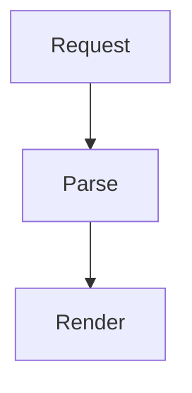

# Code Reader

Code Reader is a Neovim plugin prototype for reading AI-generated code through a structured explanation file. It keeps the source code, the current explanation step, and the outline visible at the same time.

## Explanation Format

Explanation files are Markdown files, usually stored under `.code_reader/`.

```markdown
---
type: code-reader
version: 1
---

<!-- code-reader: front-page -->
# Code Reader Overview

Explain the purpose, scope, and high-level structure of this walkthrough.

---
# 1. Request lifecycle

Source: `src/server.lua#L10-L30`

Explain the top-level flow here. Continue at [[1.1|Parse request]].

[server symbol](<treesitter://src/server.lua?query=(identifier) @code_reader.symbol>)



---
## 1.1. Parse request

Source: `src/parser.lua#L5-L12`

Explain the nested call-stack detail here.
```

- The first frontmatter block identifies the file as `type: code-reader`.
- An optional first section can be marked as a front page with `<!-- code-reader: front-page -->`.
- The front page has no source range. It is rendered in the code window with its main content, an automatic source-file summary, and a step TOC.
- Step blocks are separated by a line containing only `---`.
- The first Markdown heading in a step becomes the step title.
- Heading depth drives TOC nesting, so `## 1.1 ...` becomes a nested call-stack step.
- GitHub-style `path#Lx` and `path#Lx-Ly` references define the source range.
- Optional source hashes can be appended as `path#Lx-Ly@sha256:<hash>`.
- Obsidian-style `[[step-id]]` and `[[step-id|label]]` links jump to another step in the same explanation file.
- Markdown links that start with `treesitter://` highlight symbols in the named source file.
- Fenced code blocks marked as `mermaid` are rendered as text diagrams when Mermaid support is available.

## Diff Explanation Format

Diff explanations use the same section and navigation model with a different frontmatter type. Store the diff and its explanation together, usually under `.code_reader/diffs/`:

```markdown
---
type: code-reader-diff
version: 1
diff: ./change.diff
---

<!-- code-reader: front-page -->
# Diff Overview

Explain the change set.

---
# 1. Toggle flag

Diff: `src/app.lua#H1`

Explain the first hunk.
```

Open the markdown file with `:CodeReaderOpen`. Code Reader parses the referenced unified diff, opens a side-by-side before/after view, and shows automatic coverage on the front page.

- Coverage is based on changed lines inside hunks, not raw diff header or context lines.
- `Diff: path#Hn` references the nth hunk for that file.
- If the current source matches the pre-change context, Code Reader shows full-file before/after buffers with an in-memory patched after version.
- If the current source already matches the post-change context, Code Reader reconstructs the before version in memory and still shows full-file before/after buffers.
- If the hunk context is stale or only partially matches, Code Reader falls back to a patch-only side-by-side snippet.
- Diff side-by-side views include old/new line-number gutters, `~`/`+`/`-`/`>` markers, moved-line detection, and inline highlights for modified spans.
- Focus mode also applies to full-file diff views: unrelated rows are dimmed while the current explanation hunk stays highlighted.

Symbol links must always name the source path:

```markdown
[run](<treesitter://src/app.lua?query=(identifier) @code_reader.symbol>)
```

The source path is resolved from the project root. The Tree-sitter query selects the seed symbol with `@code_reader.symbol`; if that capture is not present, the first capture is used. When an LSP client supports `textDocument/documentHighlight`, Code Reader highlights the matching symbols reported by LSP. Without LSP results, it falls back to highlighting every Tree-sitter capture from the query.

## Installation

Using Neovim's built-in package manager:

```lua
vim.pack.add({
  {
    src = "git@github.com:KudoLayton/code-reader.nvim.git",
    name = "code-reader.nvim",
  },
}, {
  load = true,
})
```

Using lazy.nvim:

```lua
{
  url = "git@github.com:KudoLayton/code-reader.nvim.git",
  name = "code-reader.nvim",
  cmd = {
    "CodeReaderOpen",
    "CodeReaderNext",
    "CodeReaderPrev",
    "CodeReaderGoto",
    "CodeReaderToggleFocus",
    "CodeReaderClose",
  },
}
```

## Usage

Install this repository as a Neovim plugin, then open an explanation file:

```vim
:CodeReaderOpen .code_reader/flow.md
```

Commands:

- `:CodeReaderOpen [file]` opens the source, explanation, and TOC layout.
- `:CodeReaderNext` and `:CodeReaderPrev` move between steps.
- `:CodeReaderGoto {index}` jumps to a step by list index.
- `:CodeReaderToggleFocus` toggles dimming for unrelated source lines.
- `:CodeReaderClose` closes the explanation and TOC views and clears Code Reader highlights.

Inside the explanation panel, `[r` and `]r` move between steps. Press `<CR>` on links in the `Navigation` list to jump to related steps or open the source. Navigation links show source movement hints such as `(↑3)`, `(↓8)`, or `(↗ src/file.lua#L10-L20)`. Press `q` in the explanation or TOC panel to close Code Reader.

In the TOC panel, press `<CR>` to jump to the selected step. The explanation view and code view update together while focus stays in the TOC. Press `<CR>` on an internal step link or a `treesitter://` symbol link in the explanation panel to activate it.

## Mermaid

Mermaid rendering is enabled by default. Code Reader uses a small Node helper backed by `beautiful-mermaid` to render `mermaid` fenced code blocks as text diagrams. Install the npm dependency from the plugin root:

```powershell
npm install
```

With lazy.nvim, the install step can be attached as a build hook:

```lua
{
  url = "git@github.com:KudoLayton/code-reader.nvim.git",
  name = "code-reader.nvim",
  build = "npm install",
}
```

If Node, npm, or `beautiful-mermaid` is missing, Code Reader keeps the original Mermaid code block visible. To disable this feature:

```lua
require("code_reader").setup({
  mermaid = {
    enabled = false,
  },
})
```

Run `:checkhealth code_reader` to inspect Node, npm, the Mermaid helper script, and the installed dependency.

## Demo

This repository includes an inert demo project under `demo/basic`. The demo files are shipped with the plugin, but they are not in Neovim auto-load directories and do not affect startup or runtime behavior unless opened explicitly.

```powershell
cd demo/basic
nvim .
```

```vim
:CodeReaderOpen .code_reader/walkthrough.md
```

Open the diff explanation demo from the same project root:

```vim
:CodeReaderOpen .code_reader/diffs/request-update.md
```

## Tests

```powershell
lua tests/parser_spec.lua
lua tests/links_spec.lua
nvim --headless -u NONE -l tests/mermaid_spec.lua
nvim --headless -u NONE -l tests/health_spec.lua
nvim --headless -u NONE -l tests/nvim_spec.lua
nvim --headless -u NONE -l tests/open_spec.lua
nvim --headless -u NONE -l tests/symbol_spec.lua
nvim --headless -u NONE -l tests/demo_spec.lua
```
