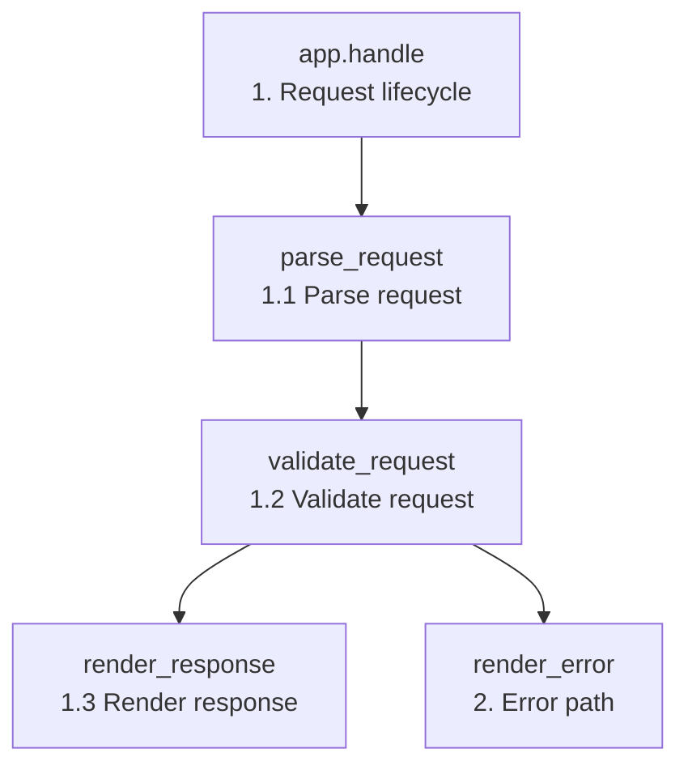

<!-- code-reader: front-page -->
# Demo Overview

## Problem

This demo is a small HTTP-style request handler. A raw request can omit fields or contain an unsupported method, so a caller needs a predictable response without adding framework details or external dependencies.

## Expected outcome

After this walkthrough, the reader can trace how valid input becomes a `200` response and how invalid input becomes a `400` response with a clear reason.

## Representative example

`{ method = "GET", path = "/docs", user = "Ada" }` is normalized, validated, and rendered as a greeting. `{ method = "DELETE" }` follows the same setup flow but ends at the error response.

## Architecture and reading flow

The main flow starts in `app.handle`, which builds request context and coordinates the rest of the program. The `request` module normalizes input and rejects invalid requests, while the `response` module turns the result into either a success response or a clear error response.

Read this walkthrough in execution order: first the top-level lifecycle, then parse and validation, then the success or error response path.

---
# 1. Request lifecycle

Source: `src/app.lua#L12-L21`

`app.handle` is the top-level path through the demo application. It builds a context, parses the request, validates it, and renders either a success or error response.

Start with [[1.1|Parse request]], then continue to [[1.2|Validate request]] and [[1.3|Render response]].

[handle](<treesitter://src/app.lua?query=(identifier) @code_reader.symbol>)

---
## 1.1. Parse request

Source: `src/request.lua#L3-L13`

`parse_request` normalizes optional request fields into a predictable table that later steps can read without repeating fallback logic.

Return to [[1|Request lifecycle]] or continue to [[1.2|Validate request]].

[parse_request](<treesitter://src/request.lua?query=(identifier) @code_reader.symbol>)

---
## 1.2. Validate request

Source: `src/request.lua#L15-L25`

`validate_request` rejects unsupported methods and empty paths before response rendering. The explicit boolean result makes the branch in `app.handle` easy to scan.

The invalid branch is explained in [[2|Error path]].

[validate_request](<treesitter://src/request.lua?query=(identifier) @code_reader.symbol>)

---
## 1.3. Render response

Source: `src/response.lua#L7-L12`

`render_response` creates the success response after validation passes. It reuses `status_line` so the status formatting is shared with the error path.

[render_response](<treesitter://src/response.lua?query=(identifier) @code_reader.symbol>)

---
# 2. Error path

Source: `src/response.lua#L14-L19`

`render_error` is reached from `app.handle` when validation fails. Compare this path with [[1.3|Render response]] to see how the two response shapes stay consistent.

[render_error](<treesitter://src/response.lua?query=(identifier) @code_reader.symbol>)
